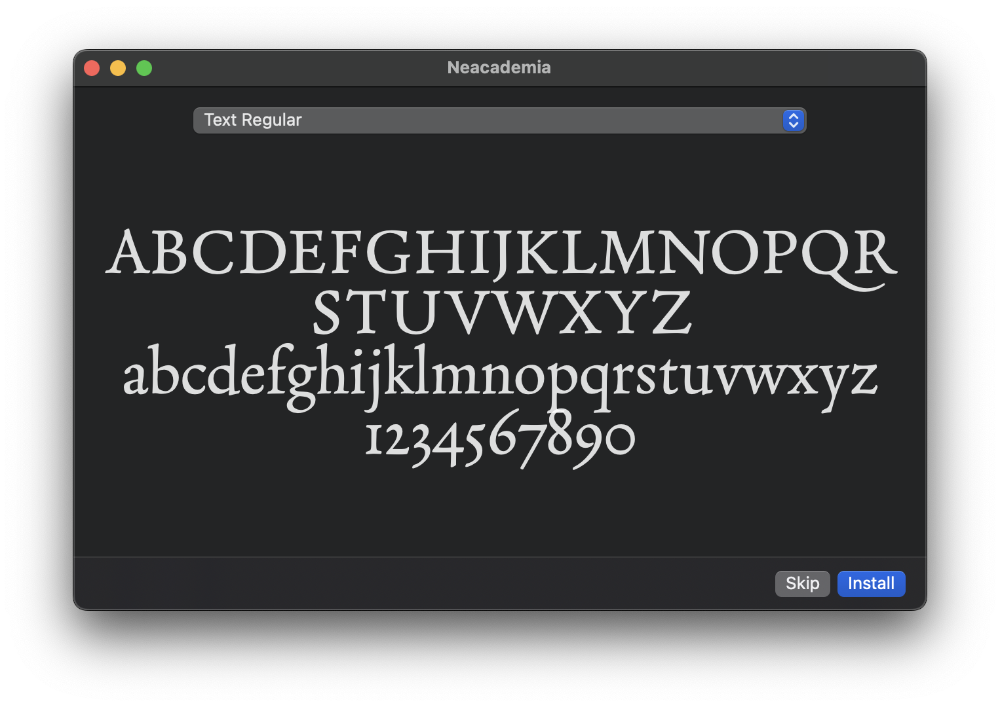

# 🍺 homebrew-fonts

Homebrew tap containing a collection of fonts I like. Also see [homebrew-nyt-fonts](https://github.com/martimlobao/homebrew-nyt-fonts) for New York Times-specific fonts.

## Usage

Tap this repository to install the available fonts:

```sh
brew tap martimlobao/fonts
brew install font-neacademia
```

## Preview




## Sources

- [Neacademia](https://rosettatype.com/Neacademia)
